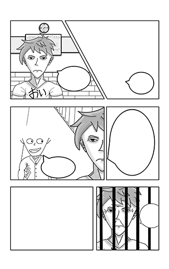

+++
title = "Eigener Manga Teil 2"
date = "2021-06-07"
draft = false
pinned = false
tags = ["Projekt", "Lernen", "Krita", "Manga"]
image = "teil2-thumbnail.png"
description = "Ein kurzes Zwischenupdate zum Thema eigener Manga."
+++
Ein kurzes Zwischenupdate zum Thema eigener Manga.

Dies ist der momentane Stand meines ersten Manga Panels. Es geht viel länger als ich gedacht habe. 

