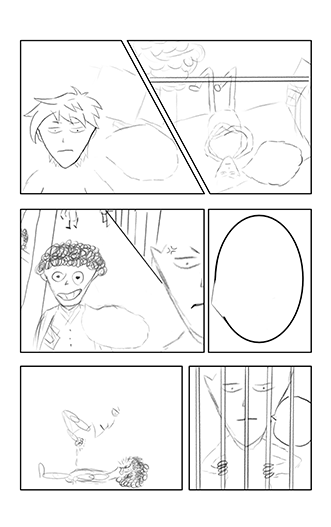
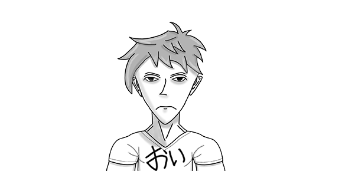

+++
title = "Eigener Manga"
date = "2021-05-17"
draft = false
pinned = false
tags = ["Projekt", "Krita", "Manga"]
image = "fill_thumbnail.png"
description = "Ich versuche mich daran einen eigenen Manga zu kreieren, der wahrscheinlich nur eine Seite haben wird.\n\nTeil 1: Sketch und Hauptcharakter."
footnotes = "Krita (Komplett Gratis): https://krita.org/en/"
+++
Ich versuche mich daran einen eigenen Manga zu kreieren, der wahrscheinlich nur eine Seite haben wird. 

**Teil 1: Sketch und Hauptcharakter.**

**Idee:**\
Ich hatte die Idee einen Manga zu machen schon etwas länger, aber dachte immer ich könne nicht genug gut zeichnen. dann aber dachte ich mit der Hilfe eines Wacom Bordes und dem Gratis Opensource Programm "Krita" (Link in Fußnote), sollte das schon gehen also fertigte ich in Krita ein Sketch Panel an. 

Der Haupt Charakter sah bis dahin noch nicht so gut aus, also: Verpasste ich ihm ein Redesign Das Ergebnis lässt sich sehen:

