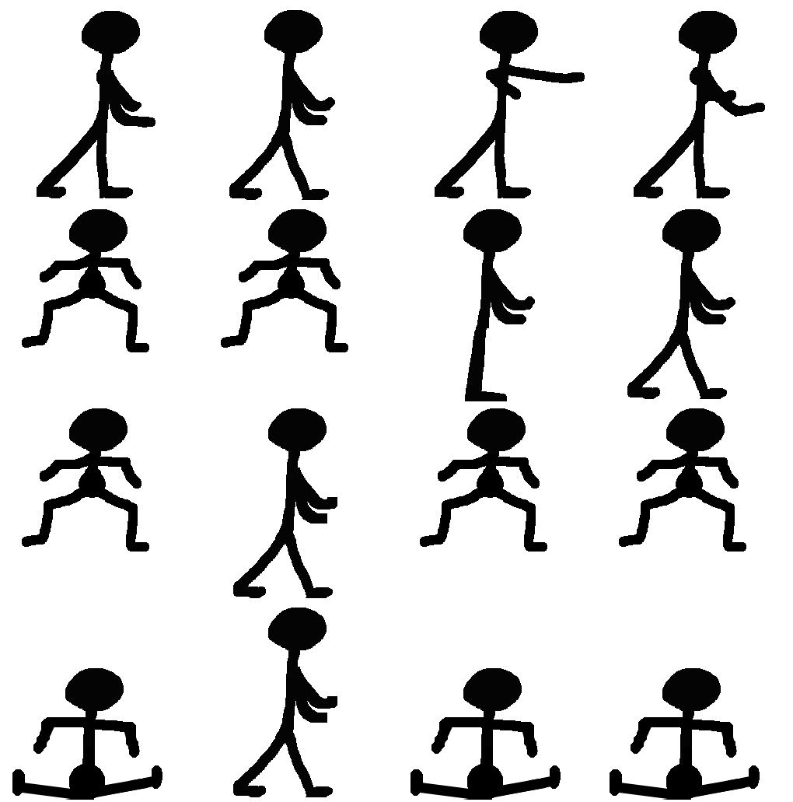
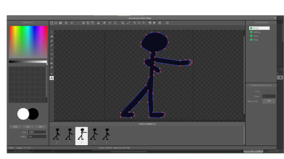
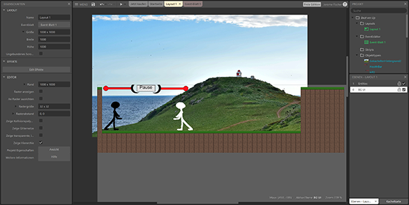
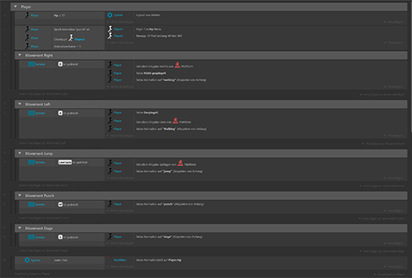

+++
title = "Eigenes Game Teil 1"
date = "2021-05-27"
draft = false
pinned = false
tags = ["Projekt", "Construct3", "Lernen"]
image = "bild_2021-05-27_110004.png"
description = "Ich versuche ein eigenes \"Beat em Up\" Game zu erstellen."
footnotes = "construct.net"
+++
Ich wollte schon sehr Lange ein eigene Game erstellen. Da ich ziemlich faul bin lernte ich aber nie eine nötige Programmiersprache so wie "C#" oder "C++"  da Stieß ich auf eine Website Namens construct 3 (Link in Fußnote). Mit der gratis Version dieses Programmes ist es möglich ohne Programmiersprachen Kenntnis ein game zu Programmieren. als Tutorial fand ich ein YouTube Video, dass zwar für ein Plattformer spiel (so wie Super Mario) ist, aber für mich reichte das. (https://www.youtube.com/watch?v=83Vi4AMJJ1o&t=1373s) ich entschied mit Für ein "Beat `em up" game. Dass heißt, 2 Charaktere die aus einer Seitenansicht gegen einander Kämpfen. Ich entschied mich dafür, weil ich dachte das, dass nicht all zu schwierig sein sollte. Zuerst zeichnete ich meinen Charakter der bis Jetzt nur ein Strichmännchen ist. Aber das kann ich mit allem ersetzen was ich will. Ich musste auch alle einzelnen bewegungsschritte des Charaktere zeichnen. 

Dazu musste ich Noch eine sogenannte Hit Box um den Charakter legen, das ist dann die form in welcher der Computer den Charakter sieht. Also eigentlich die "wahre" Form des Charakter, hinter dem Skin.

Darauf folgend kopierte ich den Charakter und färbte ihn Weiß Für den zweiten Spieler.

Dann ging es ans Skript, Also an die Funktionen. Dass heißt, dort sage ich was passiert wenn ich welche Taste drücke. Im Endeffekt Emuliere ich mit WASD die Pfeiltasten. wie man im unteren Bild sehen kann benötigte ich Keinen Code sondern konnte einfach die Funktionen auswählen. Z.B "Wenn ich D drücke dann bewege dich nach rechts, schaue nach rechts und spiele die gehen Animation ab." 

