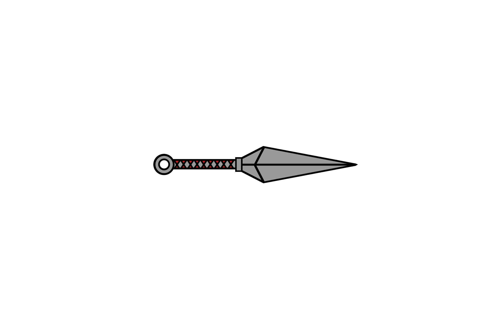

+++
title = "Mein Eigenes Logo"
date = "2021-05-05"
draft = false
pinned = true
tags = ["Design", "Illustrator"]
image = "logo_1.png"
description = "Ich Kreiere mein eigenes Logo und versuche dort meine Interessen zusammen zu Fassen."
+++
Heute begann ich damit, *meine eigenes Logo* zu kreieren. Zuerst musste ich mir überlegen, was in meinem Logo enthalten sein sollte. Also begann ich auf einem Papier zu Kritzeln und hatte dann 3 Themen, Anime, *Metal Musik* und Computer. nach langem hin und her, hatte ich dann eine skitze: 

Ich begann also damit, ein Kunai (Anime: Naruto) in Adobe Ilustrator zu kreieren die ging mehr oder weniger recht gut, und ich konnte dabei viel neues Lernen. Der Griff erinert dabei ganz bewusst an den Anime "Hunter x Hunter." 

