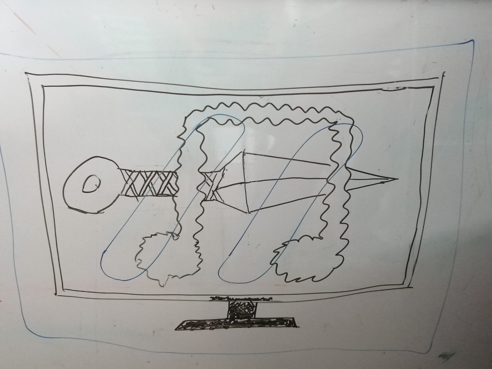
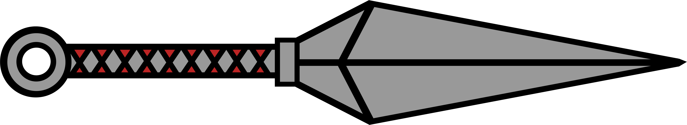
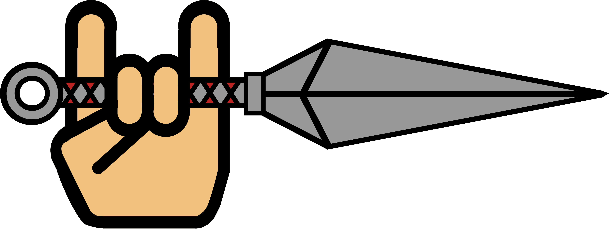

+++
title = "Mein Eigenes Logo"
date = "2021-05-05"
draft = false
pinned = true
tags = ["Design", "Illustrator"]
image = "final.png"
description = "Ich Kreiere mein eigenes Logo und versuche dort meine Interessen zusammen zu Fassen."
+++
Heute begann ich damit, *meine eigenes Logo* zu kreieren. Zuerst musste ich mir überlegen, was in meinem Logo enthalten sein sollte. Also begann ich auf einem Papier zu Kritzeln und hatte dann 3 Themen, Anime, *Metal Musik* und Computer/Videospiele. Nach langem hin und her, hatte ich dann eine Skizze: 

Ich begann also damit, ein Kunai (Anime: Naruto) in Adobe Ilustrator zu kreieren. Dies ging mehr oder weniger recht gut und ich konnte dabei viel neues Lernen wie zum beispiel das Formerstellungswerkzeug. Der Griff erinnert dabei ganz bewusst an den Anime "Hunter x Hunter." 

Danach wollte ich die verzzerte Note machen, die stark an Metal Musik errinnern sollte. Ich fand jedoch keine gute vorlage und selber brachte ich es auch nicht zu stande. Dann etschied ich mich für eine eher simplere "Metal Hand". 

Als ich dies geschafft hatte, wollte ich die beiden designs schon mal zusammen bringen. Wie man unten sehen kann. Was jetzt noch fehlt ist etwas, dass meine Interessen für Computer und Gaming darstellt. Für das Interresse an Computern packe ich alles in einen Bildschirm. Für den Gaming part, könnte ich noch etwas auf die rechte seite klatschen. Vorzugsweise etwas im zusammenhang mit der Videospielreihe "Assassins Creed". 

