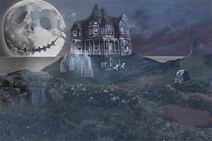

+++
title = "Photoshop Projekt \"Halloween\""
date = "2021-05-10"
draft = false
pinned = false
tags = ["Photoshop", "Projekt"]
image = "halloween-thumbnail.png"
description = "Ich erschuf mein erstes Photoshop Bild, im rahmen eines Wettbewerbes für Halloween."
+++
Im rahmen eines Wettbewerbes für Halloween erschuf ich meine erstes Photoshop Bild. Der Youtuber "Benny Productions" (https://www.youtube.com/c/BennyProductions/featured) inszenierte ein Wettbewerb um ein Drawing Board zu gewinnen man bekam Bilder, und musste alle Bilder brauchen. Nicht Mehr, Nicht weniger Bilder.

Ich wusste das ich eigentlich keine gewinn Changs hatte. aber ich dachte es währe sicher eine Lustige Herausforderung. Und, ich musste nicht alle Bilder selbst zusammen suchen. So sah es dann schließlich aus:

