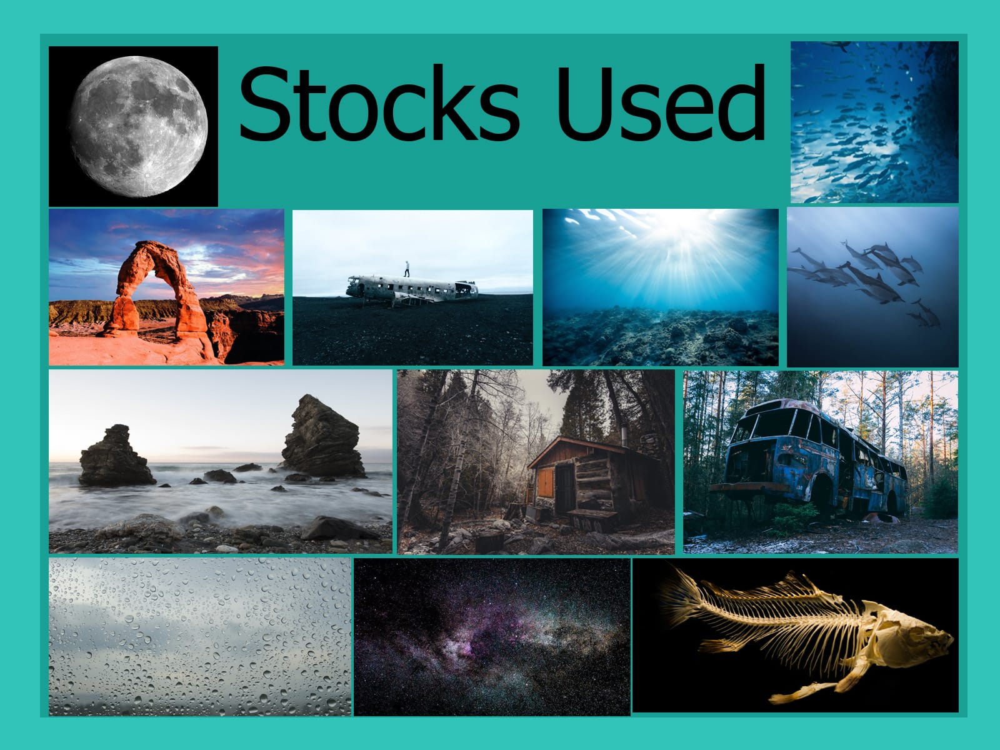

+++
title = "Photoshop Projekt \"The Underwaters\""
date = "2021-05-10"
draft = false
pinned = false
tags = ["Photoshop", "Projekt"]
image = "the-underwaters-thumbnail.jpg"
description = "Mein Zweites Photoshop Bild: \"The Underwaters\""
+++
Nach meinem ersten Bild wollte ich eines machen, bei welchem ich von Anfang an selber die Bilder wähle. es wurden schließlich diese Bilder hier:

Darauffolgend kreierte ich eine grobe Anordnung der Bilder:

Die letzten 4 Stunden habe ich in einer Timelaps zusammengeschnitten und diese dann auf YouTube hochgeladen.

<https://www.youtube.com/watch?v=2Fv_E0Lo5Jc>

Und hier noch das Finale Design:

