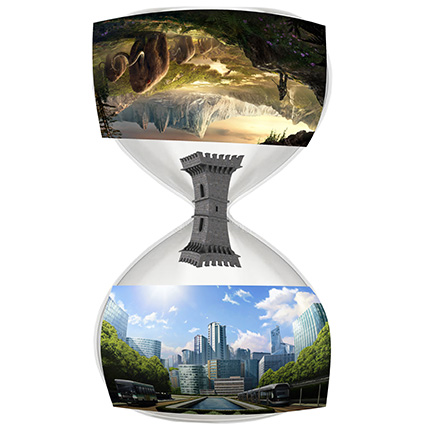
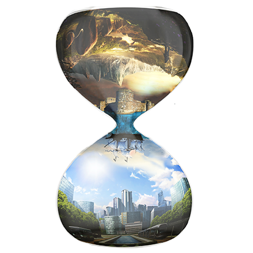

+++
title = "Photoshop Projekt \"Time\""
date = "2021-05-10"
draft = false
pinned = false
tags = ["Photoshop", "Projekt"]
image = "the-time-thumbnail.png"
description = "Bei meinem Dritten Projekt hatte ich Zwei vorgaben: \n1.Thema Zeit \n2.Nur 5 Bilder"
+++
Bei meinem 3. Projekt hatte ich 2 vorgaben: \
1: Thema Zeit \
2: Nur 5 Bilder\
Diese währen Die Sanduhr, Die Steinzeit, Die Burg Das Schiff und die Stadt.

Zuerst machte ich mir eine Vorstellung die nur halbwegs gut war:

Es war krampfhafter als man denkt, aber am Schluss ging es dann mehr oder Weniger gut aus.

